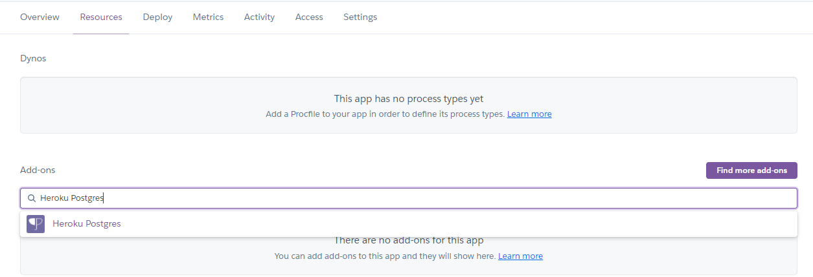
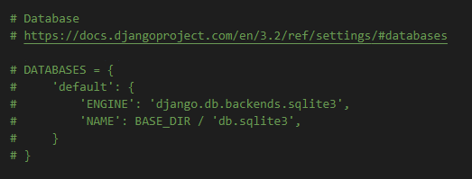
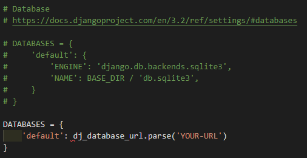
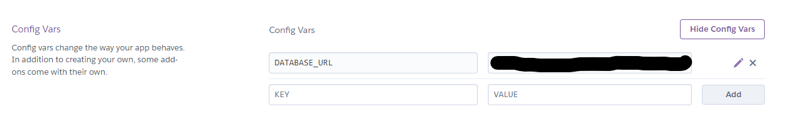
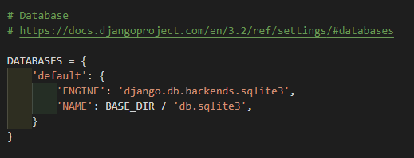
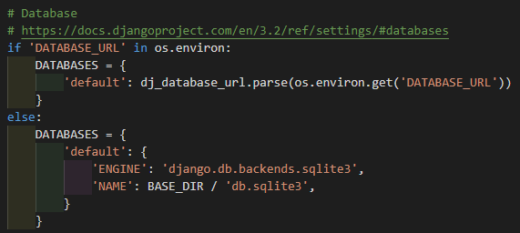
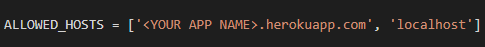
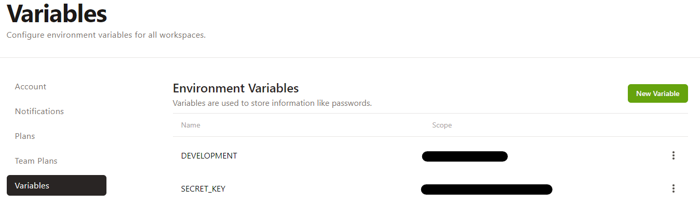

# Connect With Deployment process

**[:leftwards_arrow_with_hook: *README.md*](README.md)**

Visit the live Website : **[Connect With :arrow_right:](https://connect-with.herokuapp.com/)**.

## Table of Content

* [Get Started](#Get-Started)
  * [Cloning](#Cloning)
  * [Forking](#Forking)
  * [Installations and dependencies](#Installations-and-dependencies)
* [Live Deployment](#Live-Deployment)
  * [Create the Heroku app](#Create-the-Heroku-app)
  * [Final Steps](#Final-Steps)

This project is developed on [GitPod Workspaces IDE](https://www.gitpod.io/) (Integrated Development Environment) committed and pushed to [GitHub](https://github.com), to [The hackathon group repository](https://github.com/Tom-Nagy/together-hackathon-june-22) using GitPod Command Line Interface (CLI) with [Git version control](https://git-scm.com/).

:warning: Never share sensible and private information as they are confidential and could put the security of your data, database and website at risk.

## Get Started

1. Log in to your GitHub account.
    * To create an account you need to sign up on [GitHub](https://github.com).
2. Create a repository.
    * See [Create a repo](https://docs.github.com/en/github/getting-started-with-github/create-a-repo).
3. Now several options are available to you:
    * You can copy and paste the code and recreate the same directories structure.
    * You can **clone** my repository.
    * You can **fork** my repository.

### Cloning

When a repository is created on GitHub, it is located on GitHub website (“remotely”). You can create a copy of the repository locally on your machine. This process is called : “**Cloning a repository**”.  
When cloning a repository you are actually copying all the data that the repository contains at that time to your machine.

To clone a repository, take the following steps :

1. Navigate to [together-hackathon-june-22 repository](https://github.com/Tom-Nagy/together-hackathon-june-22).
2. Click on the **Code** dropdown button above the files list.
3. There are three options available to clone the repository :
    * using HTTPS
    * using SSH key
    * using GitHub CLI  
4. Choose HTTPS option and copy the link given.
5. Change the current working directory to the location where you want the cloned directory.
6. Open your IDE and in the CLI type : ```git clone``` and paste the link copied on step 4.
    * ```$ git clone https://github.com/YOUR-USERNAME/YOUR-REPOSITORY```
7. Press **Enter** and your local clone will be created.

For further information please go to [Cloning a repository](https://docs.github.com/en/github/creating-cloning-and-archiving-repositories/cloning-a-repository#cloning-a-repository-using-the-command-line).

### Using GitPod

To Clone a repository Using GitPod, take the following steps :

1. Install the GitPod [extension](https://chrome.google.com/webstore/detail/gitpod-dev-environments-i/dodmmooeoklaejobgleioelladacbeki) for Chrome or [Add-on](https://addons.mozilla.org/en-GB/firefox/addon/gitpod/) for Firefox.
2. Navigate to the corresponding repository [together-hackathon-june-22 repository](https://github.com/Tom-Nagy/together-hackathon-june-22).
3. Click on the **GitPod** button on the top right of the files list.
4. This will open a workspace on GitPod where you can work on the repository locally.
    * >The very first time that you do this, you need to connect GitPod and GitHub together. You need to log in with GitHub and launch your workspace (As explain above). And then you need to authorize GitPod to be able to access your GitHub account. You agree to GitPod's terms and conditions, and then create a free account. Then, it will open the workspace for you.
    Quote from : “Creating a GitPod Workspace” on [Code Institute Full Stack Software Development Programme](https://codeinstitute.net/full-stack-software-development-diploma/), by Matt Rudge.

### Using GitHub Desktop

Another option is available : GitHub Desktop. It consists of cloning a repository from GitHub to GitHub Desktop.  
For full information about how to use this option, please visit [GitHub Docs](https://docs.github.com/en/desktop/contributing-and-collaborating-using-github-desktop/cloning-a-repository-from-github-to-github-desktop).

### Forking

Forking a repository will copy it in your own repositories in GitHub.

>A fork is a personal copy of another user's repository that lives on your account. Forks allow you to freely make changes to a project without affecting the original upstream repository. You can also open a pull request in the upstream repository and keep your fork synced with the latest changes since both repositories are still connected.

To Fork a repository take the following steps :

1. Navigate to the corresponding repository [together-hackathon-june-22 repository](https://github.com/Tom-Nagy/together-hackathon-june-22).
2. Identify the ```fork``` button on the top right of the page and click on it.
3. Now you should find a copy of the repository in ```Your repositories```.

### Installations and dependencies

* A requirements.txt file was created in the main project folder. This file tells what applications and dependencies are required to run the application. When you have created/cloned/forked the project, it is import to run this command in the CLI:
  * ``pip3 install -r requirements.txt`` This will make sure to install all the apps requirements for the project.

* Side note: During development whenever a package/dependency is installed with ``pip3 install <name of the package>`` on the project, the following command is run in the CLI :
  * ``pip3 freeze > requirements.txt`` This is to make sure we update all the apps requirements in requirements.txt for local deployment or for future live deployment.

* You will need to run the migration in order to create the database from the models. Run the following commands in the CLI:
  * ``python3 manage.py makemigrations`` and then,
  * ``python3 manage.py migrate``

* The command to run the project locally (port: 8000):
  * ``python3 manage.py runserver``

* This Project was build with the Django framework, a very powerful and extensive open source project. You can find documentation in the [official Django repo](https://github.com/django/django).

The next step is the live deployment of the website :arrow_double_down:

## Live Deployment

* The website is hosted on [Heroku](https://heroku.com) where all the code except the static files will live.

### Create the Heroku app

1. Create an account or Login
    * You can sign up to Heroku with the following link: [Sing up to Heroku](https://signup.heroku.com/login)
    * You can log in to Heroku with the following link: [Login to Heroku](https://id.heroku.com/login)

2. Click on Create a new app

3. Fill up the form:
    * Make sure to give a unique name to your app.
    * Spaces are not allowed and hyphens should be used instead.
    * Set your region.
    * Click on Create app.

4. You are now directed to your app dashboard.

5. Navigate to the Resources tab.

6. In Add-ons, type Heroku Postgres and select it from the list.
    * 

7. A pop-up appears to select a plan. Select **Hobby Dev - Free**.
    * 

8. Now you need to save your current database and load it into a db.json file:
    * Previous to loading the date, ensure you have deleted user profiles from admin panel of your website to avoid any recurrences.
    * ``python3 manage.py dumpdata --exclude auth.permission --exclude contenttypes > db.json``
    * This will be the data that you will upload to Postgres. Note that you can use a different filename than "db", and it will then be ``<YOUR FILENAME>.json``

9. In order to use Postgres you will need to install **dj_database_url** and **psycopg2**.
    * In the CLI, type:
      * ``pip3 install dj_database_url``
      * ``pip3 install psycopg2-binary``

10. Freeze the requirements. In order to add the new dependencies to *requirements.txt* type in the CLI:
    * ``pip3 freeze > requirements.txt`` This will make sure Heroku install all the apps requirements when we deploy it.

11. Go to your project folder what-you-need > settings.py (root folder) and import dj_database_url by typing ``import dj_database_url`` at the top of the file.

12. Then still in settings.py, down in the Database settings, comment out the default database configuration:
    * 

13. Replace the default database with a call to *dj_database_url.parse* and give it the database URL from Heroku.
    * 
    * You can either get your url from your config variables in your Heroku app settings tab, or from the command line by typing Heroku config.
      * 

14. Run migrations by typing in the CLI:
    * ``python3 manage.py migrate`` This will apply all the migrations and get the database all set up.

15. Run the following command to load the data previously saved into the json file by typing in the CLI:
    * ``python3 manage.py loaddata db.json``
    * Note that if you used a different file name you need to replace "db" by your file name like so: ``<YOUR FILENAME>.json``

16. Create a superuser to log in with by typing in the CLI:
    * ``python3 manage.py createsuperuser``
    * Enter a Username, email address and password to complete.

17. In settings.py Remove the Heroku database config and uncomment the original so your database url doesn't end up in version control.
    * The Database settings should be reverted to the way it was:
    * 
    * :warning: The Heroku DATABASE_URL should never be public and stay secret. So do not commit your work before you removed the Heroku DATABASE_URL from your file.

18. Now to set up the database depending on the environment (Live on Heroku: -version control/production- or locally on your IDE: -development-); we add an if statement that will set the database to connect to **SQLite** if run locally or set to **Postgres** if run on Heroku.
    * In settings.py your database settings should look like this now:
    * 

19. Now we need to install gunicorn, which will act as our web server. Type in the CLI:
    * ``pip3 install gunicorn``
    * Freeze the package by typing ``pip3 freeze > requirements.txt``

20. Create a Procfile to tell Heroku to create a web dyno and how to run the project.
    * Type in the terminal ``echo web: gunicorn <NAME OF YOUR MAIN FOLDER>.wsgi:application > Procfile``.
    * It is important to note that *the name of your main folder* reflects the name of your project and is where settings.py is located; and *Procfile* is with a capital **P**.
    * Make sure that there is no blank line in your Procfile that should include only one line.

21. Add ``ALLOWED_HOSTS = ['<YOUR APP NAME>.herokuapp.com', 'localhost']`` in settings.py.
    * Add the host name of your Heroku app and localhost, so it still works on your IDE.
    * 

22. Temporarily disable collectstatic in Heroku.
    * Log-in to Heroku in the CLI by typing:
      * ``heroku login -i``
      * Enter your credentials to complete.

    * Initialize your Heroku git remote by typing in the CLI:
      * ``heroku git:remote -a < HEROKU APP NAME >``, the CLI will prompt ``set git remote heroku to <your heroku git url>``

    * Using Heroku config set, type in the CLI :``heroku config:set DISABLE_COLLECTSTATIC=1``so that Heroku will not try to collect static files when we deploy.
      * This command creates a new var in Heroku as shown below:
      * 

    * Add, commit and push your changes to GitHub.

    * Push your work to Heroku by typing: ``git push heroku main``
      * Note that here the “main/master” branch is called “main”. You can check your main branch name in the settings of your repository on GitHub.

23. Create and add a secret key to the config vars of the Heroku app in the settings tab. You can generate one by looking up [Django secret key generator online](https://miniwebtool.com/django-secret-key-generator/)
    * 

24. In settings.py change configuration for secret key and debug to separate development to production:
    * ``SECRET_KEY = os.environ.get('SECRET_KEY', '')``
    * ``DEBUG = 'DEVELOPMENT' in os.environ``
    * This is so debug is true in development environment, but false in production.
    * You will need to add Variables to your own project either in an env.py file or in your IDE variables like in Gitpod:
    * 

25. Add, commit and push your changes to GitHub.

26. In Deploy tab of your Heroku app:
    * Choose GitHub in the Deployment method section.
    * Click on connect in the following section.
    * Enable Automatic deploys in the next section.
    * Now every time you add, commit and push to GitHub, it will automatically deploy to Heroku.

### Final Steps

1. Confirm email address for our Superuser in Postgres database.

* Login to Django Admin on the deployed production website of the project by adding ``/admin`` to the website url and press enter.
* You are now directed to the admin login page.
  * Fill in the information with the credentials created when creating the superuser (step 16 of "Create the Heroku app") and login.
* Click on the Email addresses tab under ACCOUNTS.
  * :pushpin: Note that if you do not see your email address, you will need to try and login in first into the website to force allauth to create it.
  * Then repeat the first steps and login to admin, go to email addresses.
* Click on your email address and mark it as **verified** and **primary**.
* Click save.
* You have now successfully register and can log out and login into the website.
