# Connect With

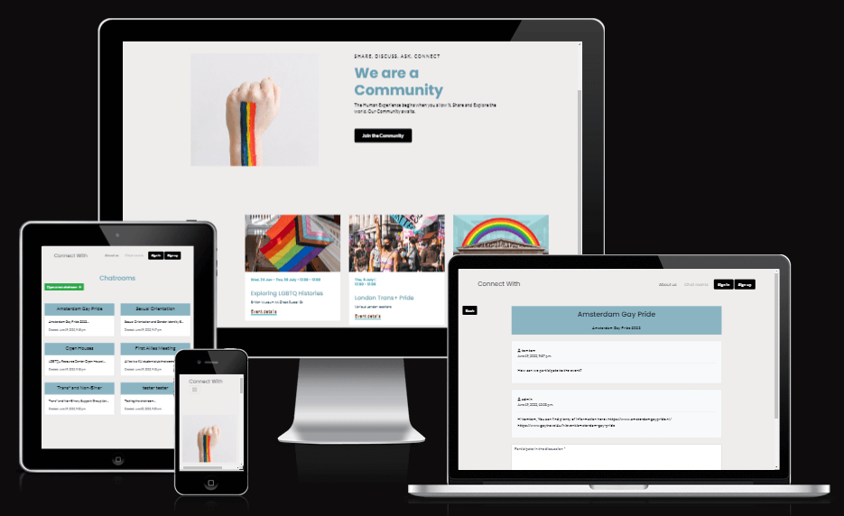

Visit the live Website : **[Connect With :arrow_right:](https://connect-with.herokuapp.com/)**

## Table of Content

- [ConnectWith](#connectwith)
  - [Table of Content](#table-of-content)
  - [Project](#project)
    - [Project Goals](#project-goals)
    - [Developer and Business Goals](#developer-and-business-goals)
  - [UX](#ux)
    - [Audience definition](#audience-definition)
    - [User stories](#user-stories)
      - [Fonts](#fonts)
      - [Icons](#icons)
      - [Colors](#colors)
      - [Styling/Feeling](#stylingfeeling)
      - [Audio/Video/Images](#audiovideoimages)
    - [Wireframes](#wireframes)
  - [Features](#features)
  - [Future features to implement](#future-features-to-implement)
  - [Database](#database)
    - [Database design](#database-design)
  - [Technologies Used](#technologies-used)
    - [Programming Languages](#programming-languages)
    - [Frameworks, Libraries and Programs](#frameworks-libraries-and-programs)

  - [Deployment](#Deployment) [:fast_forward: DEPLOYMENT.md](DEPLOYMENT.md)
    - [Get Started](DEPLOYMENT.md#Get-Started)
    - [Cloning](DEPLOYMENT.md#Cloning)
    - [Forking](DEPLOYMENT.md#Forking)
    - [Installations and dependencies](DEPLOYMENT.md#Installations-and-dependencies)
  - [Live Deployment](DEPLOYMENT.md#Live-Deployment)
    - [Create the Heroku app](DEPLOYMENT.md#Create-the-Heroku-app)
    - [Set up AWS s3 to host our static files and images](DEPLOYMENT.md#Set-up-AWS-s3-to-host-our-static-files-and-images)
    - [Connect Django to s3](DEPLOYMENT.md#Connect-Django-to-s3)
    - [Add Media folder to our bucket](DEPLOYMENT.md#Add-Media-folder-to-our-bucket)
    - [Final Steps](DEPLOYMENT.md#Final-Steps)
      - [Email set up with Django](DEPLOYMENT.md#Email-set-up-with-Django)

  - [Testing](#Testing) [:fast_forward: TESTING.md](TESTING.md)

  - [Credit](#credit)
    - [Content](#content)

## Project

### Project Goals

Connect With is a web application where users can connect and talk or share experiences. This project promotes togetherness and community.
It can be difficult sometimes to talk about something when we don't feel that the person with whom we share does not understand or share the same ideas. Though it is a necessity as human to connect and belong.
Connect With provides a safe place where everyone is welcome and can share, experience and participate in the community.

Unregistered user have a read only access and if they want to participate to discussions or ask question, they will have to registered.

### Developer and Business Goals

* Develop a viable web application.
* Develop a user-friendly application.
* Develop a web application with space for improvement and optimization.
* Promote wellness and togetherness.
* Provide a safe platform where communities can share and talk freely.

[**:back:** *Table of Content*](#Table-of-Content)

## UX

### Audience definition

* The targeted audience is You, Me and Everyone else!

### User stories

1. As a user I want a user-friendly, simple and interactive website.
2. As a user I want to be able to access this application on different device with the same experience.
3. As a user I want to find out what is the purpose of the website easily.
4. As a user I want to be able to create a discussion group/room.
5. As a user I want to be able to look for a discussion group/room.
6. As a user I want to be able to share my experiences.
7. As a user I want to be able to read the community experiences.

[**:back:** *Table of Content*](#Table-of-Content)

#### Fonts

Considering the targeted audience, the sans serif type of font is the more appropriate because it is most often associated with simplicity and straightforwardness.

The website will use well known and popular font that are used online in order to bring to the user a "feeling of knowing".

* Poppins for headings.

* Lato for main content.

Sans serif will be use as a fall back if the fonts do not load. It is common as the main typographies are sans serif type.

#### Icons

* Some Font Awesome icons will be part of the website for better UX.
* The [favicon](static/images/favicon.ico) was created from [favicon.io](https://favicon.io/favicon-converter/).

#### Colors

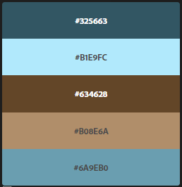

The colours chosen for the website are simple.

* #325663
* #b1e9fc
* #634628
* #b08e6a
* #6a9eb0

[Adobe Color](https://color.adobe.com) explore was used to find the colour scheme with the community keyword. Compatibility and accessibility are valid and the color scheme and swatches are said color-blind safe by the accessibility tools.

#### Styling/Feeling

The feel of the website is welcoming and simple to provide a quick access and learning process.
It makes users comfortable.

#### Audio/Video/Images

There is a hero image to give some weight to the landing page and pictures in the coming event from the events.

[**:back:** *Table of Content*](#Table-of-Content)

### Wireframes

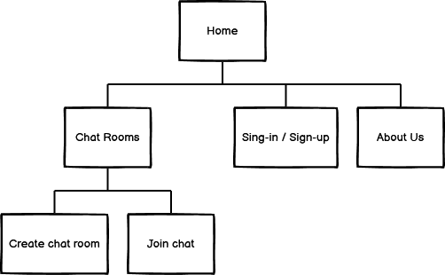

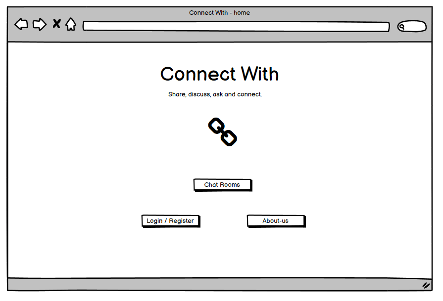
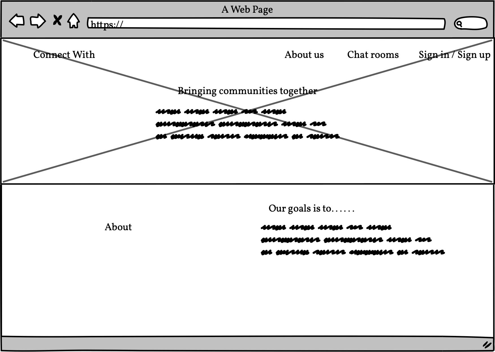
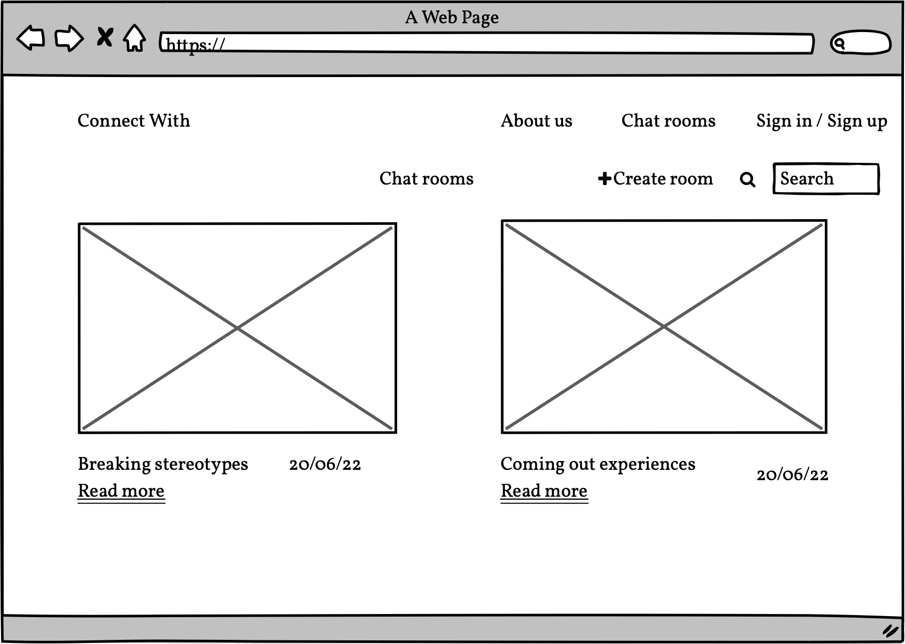
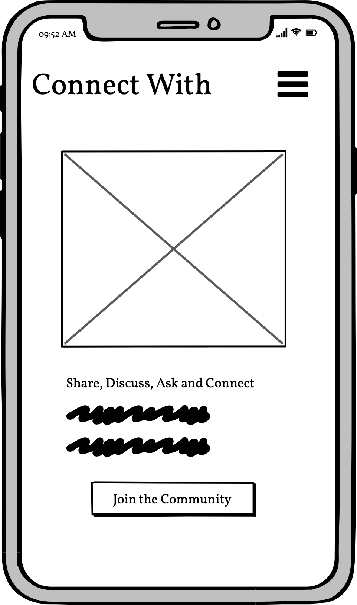

[**:back:** *Table of Content*](#Table-of-Content)

## Features

- For consistency across the website the navigation is present on all pages.
  - 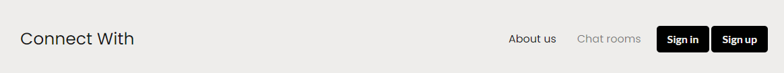

- It is important to note that other functionalities are available through the url/admin accessing Django admin interface.

### Chatrooms

- The chatroom present all the different chatrooms or discussion subject present on the website.  

- Users you can browse to see the different rooms define by a Name and a subject.  
  - 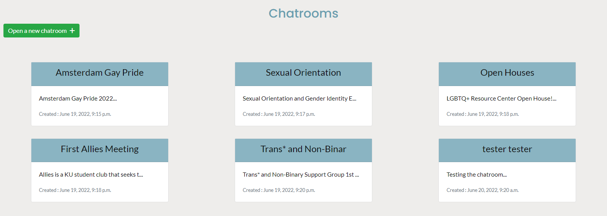

- There is the possibility to create a chatroom when registered logged in.
  - 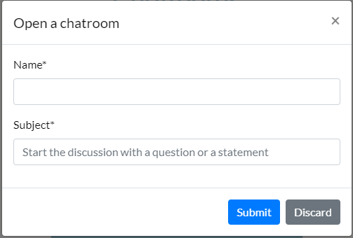

### Discuss

- When selecting a chatroom the user is directed to the discussion page.

- Users can browse the discussion, the latest comment being at the bottom of the page.

- Users can participate in the discussion when registered logged in.
  - 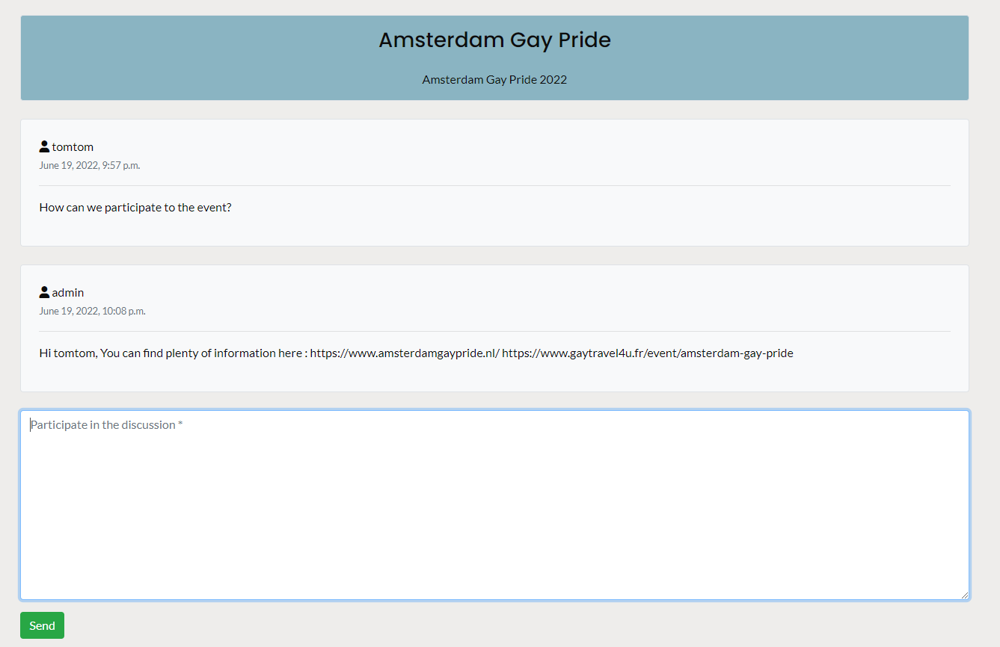

[**:back:** *Table of Content*](#Table-of-Content)

## Future features to implement

- Contact us form. Add a form for user to be able to reach out to the website owner.
- Swear words checker. For a friendlier and safer space we will implement in the future a word checker to prevent abuse posting.
- The possibility to close or silence a discussion automatically that was not active for a period of time. Those chatrooms would be accessible with a past chats button.
- Search/sort functionality to be able to sort the chats and/or to look for specific subjects.
- Favorite. Create a favorite page where registered user can see their favorite discussion.
  - Having an option to save some comment (not only the whole chat).

[**:back:** *Table of Content*](#Table-of-Content)

## Database

As a framework Django works with relational databases.

- During development, sqlite3 was used. It is the database provided by Django and only use for development.
- For Production, Postgres is used. It is the database provided by Heroku when deploying the website live.

### Database design

- Chatroom Model
  - Within the chatrooms app, the Chatroom model holds the data needed for different chatrooms.

| Name | Key in db | Validation | Field Type |
| ----------- | ----------- | ----------- | ----------- |
| chatroom_id | chatroom_id | primary_key=True | AutoField |
| name | name | max_length=20, blank=False | CharField |
| subject | subject | max_length=145, blank=False, null=False | CharField |
| date_created | date_created | auto_now_add=True | AutoField |

- Comment Model
  - Within the chatrooms app, the Comment model holds the data needed for different comments in each chatroom.

| Name | Key in db | Validation | Field Type |
| ----------- | ----------- | ----------- | ----------- |
| comment_id | comment_id | primary_key=True | AutoField |
| chatroom | chatroom | on_delete=models.CASCADE, related_name='comment' | ForeignKey to Chatroom |
| user | user | on_delete=models.CASCADE, related_name='comment' | ForeignKey to User |
| content | content | blank=True, null=True | TextField |
| date | date | auto_now_add=True | DateTimeField |

## Technologies Used

### Programming Languages

This project was developed using:

* HTML
* CSS
* Python
* Jinja templating language.

### Frameworks, Libraries and Programs

* [Balsamiq](https://balsamiq.com/wireframes/)
For creating wireframes.

* [Google Fonts](https://fonts.google.com/)
For importing fonts.

* [favicon.io](https://favicon.io/favicon-generator/)
For generating the favicon.

* [TinyPNG](https://tinypng.com/) or [Squoosh](https://squoosh.app/) or [Befunky](https://www.befunky.com/)
For resizing all the images.

* [Adobe Color](https://color.adobe.com/create/image)
For extracting the color scheme used on the website.

* [Am I Responsive?](http://ami.responsivedesign.is/?url=http://ami.responsivedesign.is/#)
For providing screenshots of the responsiveness of the website across several devices.

* [Autoprefixer CSS online](https://autoprefixer.github.io/)
For adding prefixer in style.css for cross browser compatibility.

* [Git](https://git-scm.com/)
For Version control.

* [GitPod](https://www.gitpod.io/)
For Integrated Development Environment.

* [GitHub](https://github.com/)
For hosting the repository.

[**:back:** *Table of Content*](#Table-of-Content)

## Deployment

Deployment information are published in a separate file for better readability.
Please see [DEPLOYMENT.md](DEPLOYMENT.md)

This project is developed on [Gitpod Workspaces IDE](https://www.gitpod.io/) (Integrated Development Environment) committed and pushed to [GitHub](https://github.com), to the [project repository](https://github.com/Tom-Nagy/together-hackathon-june-22) using Gitpod Command Line Interface (CLI) with [Git version control](https://git-scm.com/).

It is a team project that was build by creating pull request in order to merge the code with **main**. The main branch has been protected and pull request have to be reviewed before to be merged.

* [DEPLOYMENT.md](DEPLOYMENT.md)
  * [Get Started](DEPLOYMENT.md#Get-Started)
  * [Cloning](DEPLOYMENT.md#Cloning)
  * [Forking](DEPLOYMENT.md#Forking)
  * [Installations and dependencies](DEPLOYMENT.md#Installations-and-dependencies)
* [Live Deployment](DEPLOYMENT.md#Live-Deployment)
  * [Create the Heroku app](DEPLOYMENT.md#Create-the-Heroku-app)
  * [Set up AWS s3 to host our static files and images](DEPLOYMENT.md#Set-up-AWS-s3-to-host-our-static-files-and-images)
  * [Connect Django to s3](DEPLOYMENT.md#Connect-Django-to-s3)
  * [Add Media folder to our bucket](DEPLOYMENT.md#Add-Media-folder-to-our-bucket)
  * [Final Steps](DEPLOYMENT.md#Final-Steps)
    * [Email set up with Django](DEPLOYMENT.md#Email-set-up-with-Django)

[**:back:** *Table of Content*](#Table-of-Content)

## Testing

Testing information are published in a separate file for better readability. Please see [TESTING.md](TESTING.md).

[**:back:** *Table of Content*](#Table-of-Content)

## Credit

### Content

* For the logo and favicon:
  * Logo extracted from a set by ylivdesign [Backlink strategy icons set. Outline set of backlink strategy vector icons for web design isolated on white background](https://stock.adobe.com/ie/images/backlink-strategy-icons-set-outline-set-of-backlink-strategy-vector-icons-for-web-design-isolated-on-white-background/321783197?prev_url=detail&asset_id=321783197)

* For the hackathon group illustration on [Code Institute hackathon page](https://hackathon.codeinstitute.net/teams/181/):
  * Image by Margarita [Seamless pattern with cute panda character, vector illustration](https://stock.adobe.com/ie/images/seamless-pattern-with-cute-panda-character-vector-illustration/283480659?prev_url=detail)
